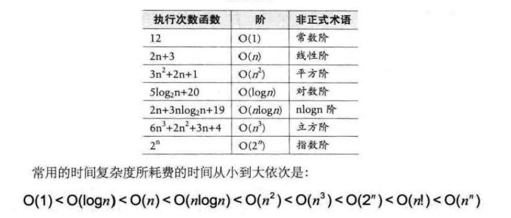

## 第二章--算法

### 算法定义

算法是解决特定问题求解步骤的描述，在计算机中表现为指令的有限序列，并且每条指令表示一个或多个操作。

***

### 算法的特性

1.输入输出：算法具有零个或多个输入。至少有一个或多个输出。

2.有穷性：是指算法在执行有限的步骤之后，自动结束而不会出现无限循环、并且每一个步骤在可接受的时间内完成。

3.确定性：算法的每一步骤都有确定的含义，不会出现二义性。

4.可行性：算法的每一步都必须是可行的，每一步都能够通过执行有限次数完成。

***

### 算法设计的要求

1.正确性：算法应该具有输入、输出和加工处理无歧义性、能正确反应问题的需求、能够得到正确答案。

2.可读性：算法设计要便于阅读、理解和交流。

3.健壮性：当输入数据不合法时，算法也能做出相关处理，而不是产生异常或莫名奇妙的结果。

4.时间效率高和存储量低。

***

### 算法效率的度量方法

1.事后统计方法（不予采纳）

2.事前分析估算方法：分析程序运行时间时，最重要的是把程序看成独立于程序设计语言的算法或一系列步骤，重要的是要把操作的数量与输入规模关联起来。

3.函数的渐近增长：给定两个函数f(n)和g(n),如果存在一个整数N,使得对于所有的n>N，f(n)恒大于g(n),则f(n)的增长渐近快于g(n)

***

### 算法时间复杂度

1.定义：语句总的执行次数T(n)是关于问题规模n的函数，进而分析T(n)随n变化情况确定T(n)的数量级。算法的时间复杂度T(n)=O(f(n)).大O记法。

2.推导大O阶方法：

> 1.用常数1取代运行时间中的所有加法常数
>
> 2.在修改后的运行次数函数中，只保留最高阶项
>
> 3.如果最高阶项存在且不为1，则去除与这个项目相乘的常数

***

### 最坏情况与平均情况

最坏情况运行时间是一种保证，平均运行时间是期望运行时间，统计量。通常所说的运行时间指最坏情况，即最坏时间复杂度。

***

### 算法空间复杂度

通过计算算法所需的存储空间实现，S(n)=O(f(n))，可以牺牲空间换取时间。

#### 愚公移山固然可敬，但发明炸药和推土机，可能更加实在和聪明。

